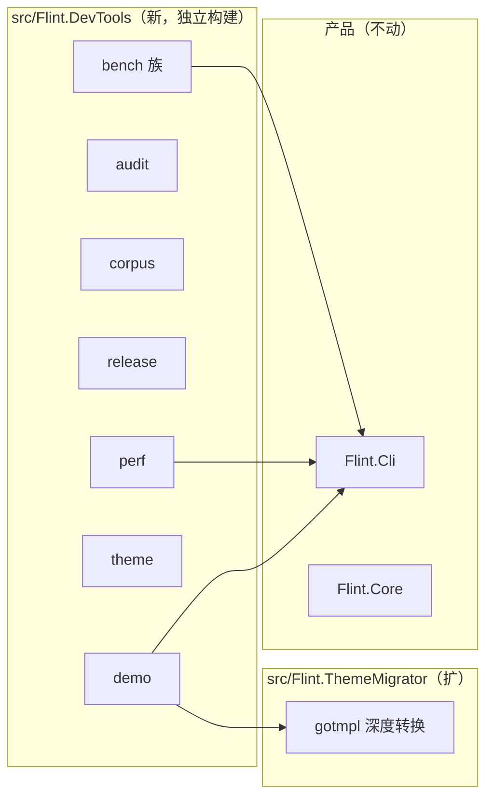
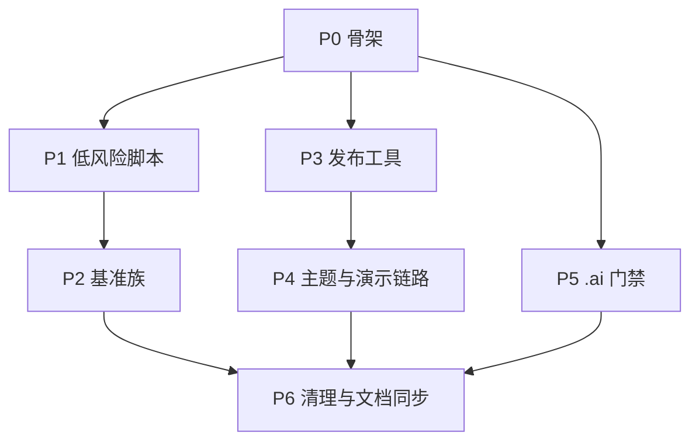

# 非 C# 代码 C# 化整改方案

> 立项日期：2026-09-26。目标：把项目内全部非 C# 代码替换为 C#/.NET 实现，
> 后续新脚本一律 C#，不再引入 Python/Bash/PowerShell。
> 依据：Karpathy 准则 1/3/4（先思考、外科手术式、目标驱动）+ AGENTS.md P0 #4（不捏造技术实体，
> 本文所有 API/包名均来自 `Directory.Packages.props` 与本仓库源码实测）。

## 1. 结论

项目当前非 C# 代码合计 **5,327 行**，占代码总量（C# 132,123 行，src 49,745 + tests 82,378）的 3.9%。
其中仓库内 2,925 行（Python 1,593、Bash 1,075、PowerShell/cmd 257），工作区 `.ai/scripts/` 目录
2,402 行 bash 质量门禁（位于 git 仓库外，属 AI 工作流基础设施）。

**核查后的事实修正**：产品 `Flint.exe` 的主构建路径已经是纯 C#。模板（Scriban）、内容解析、
JS 模块打包（EsmBundler）、TypeScriptStripper、MinifyJs、YAML（YamlDotNet）、SCSS（DartSassHost
2.0.13 NuGet 包 + native 资产随发布输出）全部由 C# 代码或 C# 库驱动。`tools/dart-sass/` 是
Hugo 侧基准对比用的外部 dart-sass（Hugo v0.153+ 起 LibSass 弃用，需外部 sass），不是产品依赖。

整改判断：**剩下 5,327 行全部可以 C# 化，建议分 7 个阶段推进，预计 [推断] 4 到 6 周单人工作量**。
刻意保留的只有两处外部程序调用（是被调用的程序，不是项目里的外语代码）：

| 外部程序 | 调用点 | 保留理由 |
|---|---|---|
| esbuild | `src/Flint.Core/Assets/JavaScriptBundler.cs`（js.Build） | 已有 C# 降级路径（esbuild 缺席走 C# SimpleMinify + EsmBundler），此处仅作高质量压缩加速；Hugo 同样调用外部 esbuild |
| git CLI | `GitDateProvider.cs`（2 处）、`ModuleManager.cs`（1 处）、`DeployHandler.cs`（2 处） | 行为对齐 Hugo `hugo mod get`/`enableGitInfo` 语义；换 LibGit2Sharp 收益为负且引入新依赖 |

## 2. 现状盘点（逐文件）

### 2.1 仓库内脚本（22 个文件 / 2,925 行）

**Python（11 个 / 1,593 行）**

| 文件 | 行数 | 用途 | 消费方 |
|---|---|---|---|
| `scripts/ssg-bench.py` | 100 | 万页双引擎同口径对比基准 | README、HUGO-GAP-TASKS |
| `scripts/complexity-bench.py` | 168 | L1/L2/L3 复杂度阶梯双引擎 | HUGO-GAP-TASKS |
| `scripts/memory-bench.py` | 62 | 峰值 RSS/USS 采样（psutil） | 性能诊断记录 |
| `scripts/asset-bench.py` | 127 | L4 资源管线画像（图片+Sass） | PERFORMANCE-PLAN |
| `scripts/corpus-convert.py` | 104 | MDN 语料转 Flint/Hugo 双站点 | 语料制备 |
| `scripts/audit-elements.py` | 72 | 21 主题元素签名多重集差 | HUGO-COMPAT-MATRIX |
| `scripts/check-broken-assets.py` | 55 | 断链/断资产扫描 | HUGO-COMPAT-MATRIX |
| `scripts/release-github.py` | 190 | GitHub 发布页五步（建页/等资产/派发/体检） | CONVENTIONS §10.2 |
| `theme-migrator/gotmpl2scriban.py` | 533 | Go 模板→Scriban 一次性深度转换 | THEME-COMPAT-PLAN、theme-migrator README |
| `demo-sites/fixtures/corpus/count_chars.py` | 59 | 演示长文字数统计 fixture | demo-sites |
| `demo-sites/fixtures/corpus/gen_images.py` | 123 | 演示图片 fixture 生成 | demo-sites |

**Bash（7 个 / 1,075 行）**

| 文件 | 行数 | 用途 |
|---|---|---|
| `demo-sites/demo-sites.sh` | 246 | 21 主题演示站编排（建站+迁移+构建+报告+可选服务） |
| `theme-migrator/verify-themes.sh` | 288 | 候选主题 Hugo 侧三条件验证（exit=0+有页数+最小页>200B） |
| `scripts/theme-matrix20.sh` | 340 | 21 主题兼容矩阵 |
| `theme-migrator/clone-themes.sh` | 56 | 上游主题浅克隆（基础池） |
| `theme-migrator/clone-candidates.sh` | 66 | 候选池补充克隆 |
| `demo-sites/build-gallery.sh` | 47 | 画廊站构建 |
| `demo-sites/demo-stop.sh` | 32 | 演示服务停止 |

**PowerShell / cmd（3 个 / 257 行）**

| 文件 | 行数 | 用途 |
|---|---|---|
| `scripts/perf-gate.ps1` | 123 | 性能回归门禁（三轮中位数 + 基线棘轮 + HTML 报告） |
| `scripts/run-performance-tests.ps1` | 68 | 性能测试入口 |
| `scripts/run-performance-tests.cmd` | 66 | Windows cmd 包装壳 |

### 2.2 工作区 `.ai/scripts/`（20 个 bash / 2,402 行，仓库外）

test-gate / flaky-gate / gate-check / review-gate / assertion-strength-check / encoding-gate /
fix-completeness-check / doc-consistency-check / tech-debt-scan / verify-action-items 等 20 个
grep 型机械门禁，由 zcode hooks 与发布前清单调用。`.ai/` 下的提示词文档（如
`.ai/test/prompt.md`）引用这些脚本名，属文档同步范围。

### 2.3 已完成的替代先例（证明可行性）

- `demo-serve.py`（Python HTTP 服务）→ `demo-sites/demo-serve/`（C# 项目），已上线（de8e578/d1b45af），
  21 主题服务内存从 490MB 降到 21MB。
- EsmBundler + TypeScriptStripper + MinifyJs：JS/TS 处理全部 C# 自研，未引入 Node 运行时。

## 3. 目标与边界

**目标**

1. 仓库内 Python/Bash/PowerShell/cmd 脚本清零，能力由 C# 工具承载。
2. `.ai/scripts/` 20 个 bash 门禁合并为 1 个 C# 门禁工具，hooks 改调 C# 入口。
3. 所有引用旧命令的文档（README、docs/**、theme-migrator README、.ai 提示词）同批更新，
   `grep` 旧事实值全仓库零残留（Karpathy 准则 8 三方一致）。

**显式不做（防 Kitchen Sink 范围蔓延）**

- 不重写 SCSS 编译器与 JS minify 引擎（产品已 C# 库化；esbuild 保留为可选加速）。
- 不引入新 NuGet 依赖（GitHub 发布工具用 BCL `HttpClient`；进程/内存用 `System.Diagnostics`）。
- 不动 `benchmarks/corpus/`、`theme-migrator/themes/`、`candidates/`、fixtures 内容等可再生语料数据。
- 不改 `Flint.Cli` 产品命令面（bench/audit/release 是开发工具，不进产品 CLI）。
- `demo-serve` 已是 C#，不在范围；git CLI 三处 spawn 不动。

## 4. 目标架构

新增 `src/Flint.DevTools/` 控制台项目：net10.0、`System.CommandLine` 2.0.12（与 Flint.Cli 同款，
已在 CPM 中管理，零新依赖）、输出可 AOT 发布的单文件工具。子命令集：

| 子命令 | 替代对象 | 说明 |
|---|---|---|
| `bench ssg` | ssg-bench.py | 外部高精度计时 + 冷构建 + 预热 1 + 3 次中位数 + 产物对称审计 |
| `bench complexity` | complexity-bench.py | L1/L2/L3 × 双引擎 |
| `bench memory` | memory-bench.py | 峰值 RSS/USS（`Process` API 替代 psutil） |
| `bench asset` | asset-bench.py | 图片 + Sass 资源管线 |
| `audit assets` | check-broken-assets.py | 断链扫描（cygpath hack 随之消失） |
| `audit elements` | audit-elements.py | 元素签名多重集差 |
| `corpus convert` | corpus-convert.py | MDN 语料转换 |
| `corpus fixtures` | count_chars.py / gen_images.py | 演示 fixture 生成 |
| `release …` | release-github.py | `HttpClient` 调 GitHub REST API，token 走 `GITHUB_TOKEN` 环境变量，不落盘 |
| `perf gate` / `perf run` | perf-gate.ps1 / run-performance-tests.* | 基线棘轮 + HTML 报告 |
| `theme clone` / `theme verify` / `theme matrix` | clone-*.sh / verify-themes.sh / theme-matrix20.sh | 主题链路 |
| `demo build` / `demo gallery` / `demo stop` | demo-sites.sh / build-gallery.sh / demo-stop.sh | 演示站编排 |
| gotmpl 深度转换 | gotmpl2scriban.py | 并入 `src/Flint.ThemeMigrator`（已有 GoTemplateLexer/Parser/ScribanConverter，AOT 安全） |

**架构决策点（隐性决策，标注供裁决，不自行定案）**

| # | 决策 | 推荐 | 理由 |
|---|---|---|---|
| D1 | DevTools 放 `src/` 独立项目还是并入 Flint.Cli | 独立项目，且**不加入 Flint.slnx**（参照 Flint.ThemeMigrator 先例） | 产品 AOT 发布面不掺入基准/发布工具；产品解决方案保持两个项目 |
| D2 | .ai 门禁：20 个 bash 合并为 1 个 C# 工具，还是逐脚本平移 | 合并为 1 个门禁工具（子命令路由） | 逐文件平移 = 20 份维护面；用户全局 `~/.zcode/scripts/` 已有 C# 门禁先例（new-skip-guard.cs）。代价：hooks 首切需先构建一次 |

## 5. 分期实施计划

| 阶段 | 内容 | 预估 [推断] | 退出条件 |
|---|---|---|---|
| P0 骨架 | DevTools 项目骨架 + 子命令路由 + `version` 影子命令打通构建/AOT 发布链 | 0.5 天 | `dotnet run --project src/Flint.DevTools -- version` 输出版本，0 警告 |
| P1 低风险脚本 | `audit assets`、`audit elements`、`corpus fixtures`（count_chars/gen_images）。特性：无外部进程、纯文件 IO | 1.5 天 | 与 Python 版同输入对拍输出一致（见 §6 CS-6/CS-7） |
| P2 基准族 | 四个 bench + perf run/gate。核心是把"外部高精度计时 + 冷构建 + 中位数 + 产物对称审计"口径完整迁移 | 1.5–2 周 | 每个 bench 与 Python 版同语料对拍：同量级数字（±10% 内）+ 产物对称审计逻辑 C# 版同样能抓出历史事故样本 |
| P3 发布工具 | `release` 子命令替代 release-github.py（建页/等资产/派发/体检），cmd 包装壳删除 | 2–3 天 | 对已存在 tag 走 `--verify` 只读体检，输出与 Python 版一致；CONVENTIONS §10.2 更新 |
| P4 主题与演示链路 | gotmpl2scriban 能力并入 ThemeMigrator（先差距分析）+ clone/verify/matrix + demo 编排 | 1–1.5 周 | 21 主题矩阵 C# 版跑出与 bash 版相同的 21/21 结果；demo 编排产出的站点目录结构与 bash 版一致 |
| P5 .ai 门禁 | 20 个 bash 合并为 C# 门禁工具，hooks 切换 | 1–2 周 | 门禁逐项与 bash 版对拍（用历史违规样本验证"能失败"，mutation probe）；hooks 切到 C# 入口 |
| P6 清理与文档同步 | 删除全部旧脚本、grep 旧命令零残留、文档同步、checkpoint 提交 | 2–3 天 | §8 终态验收全过 |

**阶段纪律**

- 旧脚本保留到新旧对拍通过才删，"删除是最后一刀"（反事实验证）。
- 每阶段一个独立提交，message 用 `checkpoint: <里程碑>`（AGENTS.md 长会话规则）。
- 每阶段只动该阶段文件，不做跨阶段顺手改（Karpathy 准则 3）。

## 6. 任务清单

验收标准列中"对拍"指：同输入下 C# 版与 Python/Bash 版输出逐项比对（文本类）或同量级（基准类）。

| ID | 阶段 | 任务 | 验收标准 | 依赖 |
|---|---|---|---|---|
| CS-1 | P0 | 建 `src/Flint.DevTools` 项目（net10.0、System.CommandLine、`TreatWarningsAsErrors` 继承 Directory.Build.props） | `dotnet build` 0 警告 | D1 裁决 |
| CS-2 | P0 | 子命令路由骨架 + `version` 影子命令；确认可 AOT `dotnet publish` 单文件 | 构建+发布冒烟通过 | CS-1 |
| CS-3 | P1 | `audit assets`：断链扫描移植（消除 cygpath） | 对 21 主题全量扫描，输出与 check-broken-assets.py 逐行一致 | CS-2 |
| CS-4 | P1 | `audit elements`：元素签名多重集差移植 | 对 21 主题输出与 audit-elements.py 一致 | CS-2 |
| CS-5 | P1 | `corpus fixtures`：count_chars + gen_images 移植（图片用 ImageSharp 3.1.12 生成，与产品同库） | 同尺寸 fixture 输出字节级同尺寸；字数统计一致 | CS-2 |
| CS-6 | P2 | `bench ssg` 移植（计时/冷构建/预热+中位数/产物对称审计四件套） | 同语料同轮次数字与 ssg-bench.py 相差 ≤10%；用历史不对称事故样本回放能报 FAIL | CS-2 |
| CS-7 | P2 | `bench complexity` 移植 | 同上对拍 | CS-2 |
| CS-8 | P2 | `bench memory` 移植（psutil → System.Diagnostics.Process，口径标注 RSS/USS 各自 API 来源） | 同语料峰值内存与 Python 版相差 ≤15% 并附口径说明 | CS-2 |
| CS-9 | P2 | `bench asset` 移植 | 同上对拍 | CS-2 |
| CS-10 | P2 | `perf run` + `perf gate` 移植（基线 JSON 棘轮 + HTML 报告） | 基线棘轮语义与 perf-gate.ps1 一致；首轮重录基线（14 天未刷，换代重录有先例） | CS-2 |
| CS-11 | P3 | `release` 全部子动作（建页/等待四平台/--dispatch/--wait-only/--verify） | 对存量 tag `--verify` 只读输出与 Python 版一致；token 只从 `GITHUB_TOKEN` 读，日志不打印 | CS-2 |
| CS-12 | P3 | 删除 run-performance-tests.cmd/.ps1、perf-gate.ps1（对拍通过后） | 文件删除 + 引用点清零 | CS-10 |
| CS-13 | P4 | gotmpl2scriban 能力差距分析（对比 533 行 Python 与 C# ThemeMigrator 的 GoTemplateLexer/Parser/ScribanConverter 覆盖矩阵） | 差距清单文档化（能力/ TODO-HUGO 标记/手工项） | CS-2 |
| CS-14 | P4 | 按 CS-13 清单补齐 ThemeMigrator，`gotmpl` 子命令上线 | 21 主题全量深度转换产出与 Python 版 diff 空或白名单化差异；TODO-HUGO 标记行为一致 | CS-13 |
| CS-15 | P4 | `theme clone`（clone-themes + clone-candidates 合并） | 候选池克隆结果与 bash 版一致（浅克隆/过滤规则逐条对齐） | CS-2 |
| CS-16 | P4 | `theme verify`：Hugo 侧三条件验证 | 与 verify-themes.sh 同判定结果 | CS-2 |
| CS-17 | P4 | `theme matrix`：theme-matrix20.sh 移植 | 21/21 矩阵结果与 bash 版一致 | CS-16 |
| CS-18 | P4 | `demo build` / `demo gallery` / `demo stop` 移植（22 主题编排、端口 8401 起、SERVE=1 语义） | 产物目录树与 bash 版一致；demo-stop 语义一致 | CS-14 |
| CS-19 | P4 | 删除 theme-migrator/*.sh、demo-sites/*.sh（对拍通过后） | 删除 + 引用清零 | CS-15..CS-18 |
| CS-20 | P5 | .ai 门禁 C# 化：建门禁工具，20 个 bash 合并为子命令（按 §4 D2 裁决形态） | 每个门禁用历史违规样本对拍，输出与 bash 版一致 | D2 裁决 |
| CS-21 | P5 | 门禁工具 mutation probe：注入已知违规样本验证每个门禁"能失败" | 20/20 门禁抓到注入样本 | CS-20 |
| CS-22 | P5 | zcode hooks / 项目调用点切到 C# 门禁入口 | hook 配置更新且跑通一次全量 | CS-21 |
| CS-23 | P5 | 删除 .ai/scripts/*.sh（对拍通过后） | 删除 + .ai 提示词文档引用同步 | CS-22 |
| CS-24 | P6 | 删除已有对拍保障的全部 .py 脚本 | git rm 干净 | CS-3..CS-11, CS-14 |
| CS-25 | P6 | 文档同步（准则 8）：README、docs/CONVENTIONS.md §10.2、HUGO-COMPAT-MATRIX、HUGO-GAP-TASKS、PERFORMANCE-PLAN、THEME-COMPAT-PLAN、theme-migrator/README.md、.ai 提示词 | grep 旧命令模式（`python scripts/`、`\.sh`、`\.ps1`、`\.cmd`）在 docs+README+.ai 中零残留 | CS-24 |
| CS-26 | P6 | 新增 C# 工具自身的测试（至少一个对拍测试锁住基准口径或门禁行为） | Flint.IntegrationTests 或 DevTools 测试项目有对应测试且红过 | CS-24 |
| CS-27 | P6 | 更新 AGENTS 型项目规范新增"新脚本一律 C#"条目（CONVENTIONS.md） | 条目入库且与 §3 目标一致 | CS-25 |

## 7. 风险与对策

| 风险 | 影响 | 对策 |
|---|---|---|
| 基准口径迁移失真（最高风险） | 假性能数据误导后续优化 | 四件套（外部计时/删输出冷构建/预热+中位数/产物对称审计）逐项对拍；用 2026-09-08 MDN 不对称事故样本回放验证 C# 版审计器"能失败" |
| psutil → Process API 口径差 | 内存数字不可比 | 对拍容差 ≤15% 并在报告标注 C# 侧 API 来源；>15% 先查口径再决定是否调整 |
| perf-gate 基线换代 | 棘轮误判 | 首轮重录基线并记档（13d4b1e 方案 A 换代先例） |
| .ai hooks 冷启动（构建前不可用） | 切窗期门禁空转 | 切 hook 前先构建一次门禁工具二进制；切换与验证在同一任务内完成（CS-22） |
| 门禁机检消失期 | 期间违规漏检 | 按阶段推进，bash 版保留到对拍通过才删；不并行删多阶段 |
| DevTools AOT 与产品发布混淆 | 产品发布面被污染 | D1 裁决独立项目且不入 slnx；DevTools 发布走独立命令 |

## 8. 终态验收（总标准）

1. 仓库内零 `.py` / `.sh` / `.ps1` / `.cmd` 脚本文件（`git ls-files` 计数为 0，demo-sites 目录自带的
   Hugo 主题自带 `build.sh`/`.ci/` 属上游主题语料，不在清理范围）。
2. `grep -rn --include='*.md' -E 'python scripts/|\.sh\b|\.ps1\b' docs README.md .ai` 零业务命中
   （benchmarks 语料与上游主题自带文件除外）。
3. 全部开发动作有 C# 入口：`dotnet run --project src/Flint.DevTools -- <子命令>`。
4. 每个迁移项都有"旧实现 vs C# 实现"对拍记录留档（docs/PERFORMANCE-PLAN.md 或迁移日志）。
5. `.ai/scripts/` bash 清零，门禁由 C# 工具承载且 mutation probe 全过。

## 9. 回滚策略

- 每阶段一个提交，失败时 `git revert` 该阶段提交即可恢复旧脚本与旧入口。
- 任何对拍失败：该阶段回退，旧脚本保留，失败原因留档后再议（不降标准放行）。

## 10. 工作量汇总（[推断]，单人）

| 阶段 | 预估 |
|---|---|
| P0 骨架 | 0.5 天 |
| P1 低风险脚本 | 1.5 天 |
| P2 基准族 | 1.5–2 周 |
| P3 发布工具 | 2–3 天 |
| P4 主题与演示链路 | 1–1.5 周 |
| P5 .ai 门禁 | 1–2 周 |
| P6 清理与文档同步 | 2–3 天 |
| **合计** | **约 4–6 周** |
