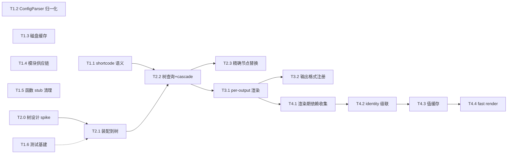

# Flint 演进任务清单（基于 Hugo 对比研究）

> 生成于 2026-09-03，来源：全量架构评审（评级 C+，7 个修复提交 494b46f..f9b8a5d）+ Hugo 源码对比研究（C:\dev\GitHub\hugo，Go，约 12.8 万行）。
> 用途：跨会话推进的施工图。每个任务自包含，标注 Hugo 参考实现与 Flint 目标文件，新会话可直接领取。
> 优先级：P1 > P2 > P3。规模：S（半天内）/ M（1-2 天）/ L（3-5 天）/ XL（1-2 周，需先出设计）。
> **✅ 状态（2026-09-04）：全部 22 项完成（Phase 0-5 清零）。** 本会话完成 T5.2 收尾（81147a7）、term 语义缺口（e927d68）、T3.1/T3.2（ad8c782）、T5.1（23b1e3f）、T4.1/T4.1a（b943d6a）、T4.3（5c72aba）、T4.2（eca265b）、T4.4（a182707）。

---

## Phase 0：已完成基线（无需重做）

- [x] 评审修复 7 批次：路径穿越 / FM fail-fast / mod 退出码 / Sass 并发锁 / esbuild 参数 / watcher 反馈循环 / Deploy 死锁脱敏 / AutoLoad 接线 / 缓存键指纹 / Markdig 单次解析 / MinifyCss 真实现 / E2E 空转断言清理 / IncrementalBuilder 接线 / AOT 警告策略矫正 / README 诚实化
- [x] 验证基线：编译 0 错误、单元 779/779、集成 1660/1660（历史首次全绿）

---

## Phase 1：局部修复（不动地基，性价比最高）——✅ 全部完成（2026-09-03，提交 908fb21..0bd8dff）

- [x] ### T1.1 Shortcode 双语义纠正 ✅ 25a9a44（含站点级模板短代码 TemplateShortcode）
- **问题**：Flint 把 `` 与 `{}` 的输出一律先展开再送 Markdig，与 Hugo 相反；`DelimiterType` 解析后全项目零引用；错误以 HTML 注释内嵌而非 fail-fast。
- **Hugo 参考**：`hugolib/shortcode.go`（`insertPlaceholder`:229、`expandShortcodeTokens`:725，含 `
` 粘连修正）、`parser/pageparser/item.go:146`（`IsShortcodeMarkupDelimiter`）、`hugolib/shortcode.go:572-721`（模板缺失/未闭合 fail-fast，错误带行列）。
- **Flint 目标**：`src/Flint.Core/Content/ContentParser.cs`、`Content/Shortcodes/ShortcodeProcessor.cs`、`Shortcodes/ShortcodeToken.cs`。
- **做法**：`` 展开为占位符（如 `{{SHORTCODE:n}}`），Markdig 渲染完成后替换回结果（输出避开 Markdown 处理）；`{}` 输出内联参与 Markdown；嵌套 `{}` 的内层先渲染并清理 `
` 包裹；未知 shortcode/配对错误 fail-fast 并携带名称与位置。
- **验收**：集成测试断言 `` 类 HTML 输出不被 Markdig 重排（不被 `
` 包裹）；两种定界符嵌套组合用例；fail-fast 错误消息含 shortcode 名与源位置。
- **注意**：占位符需防内容中字面 `{{SHORTCODE:n}}` 误替换（现有缺陷，一并修）。

- [x] ### T1.2 ConfigParser 归一化重构 ✅ 0bd8dff（1524→850 行，三胞胎全删，Serialize 全量，DisableKinds 数组化，menu/cascade 填充）
- **问题**：1524 行 static class，30 字段 × 4 份平行映射（TOML/JSON/Dict/序列化），新增字段改 5-6 处；`disableKinds` 按 bool 解析（Hugo 是字符串数组）；页面级 `menu`/`cascade` 三重丢弃；Serialize 丢 10+ 子配置。
- **Hugo 参考**：`config/defaultConfigProvider.go`（map 合并层，`Set` 递归合并、`RenameKeys` 别名迁移）、`resources/page/pagemeta/page_frontmatter.go:105-116`（递归小写 key + `mapstructure.WeakDecode`，无手写 getter）。
- **Flint 目标**：`src/Flint.Core/Configuration/ConfigParser.cs` → 归一化字典树中间层 + 单份映射；`Abstractions/IConfigLoader.cs` 中的 17 个配置类保持不变（下游零改动）。
- **做法**：三格式解析先归一化为字典树（key 递归小写，对齐 Hugo `hmaps.PrepareParams`），单份 Convert 映射到 `SiteConfig`；`disableKinds` 改数组；`menu`/`cascade` 进入模型；Serialize 全量写回。
- **验收**：新增配置字段只改 1 处映射；三格式往返 property test 全绿；`grep "disableKinds"` 确认数组语义；现有配置测试（600+ 行级）通过。
- **依赖**：无（测试安全网已就绪，评审遗留项清单第 1 位）。

- [x] ### T1.3 磁盘缓存 ✅ 2084bda+5c76db1（DiskAssetCache 实现 IContentAddressableCache + 默认接线）
- **问题**：图片变换、Sass 编译产物每次构建重算；`ContentHashCache` 曾有的持久化路径是死代码（已删），当前无任何跨进程缓存。
- **Hugo 参考**：`cache/filecache/filecache.go`（命名缓存 + `ReadOrCreate` + 每 entry 锁）、`filecache_config.go`（MaxAge=-1 永久 / 0 禁用，可配置覆盖）、`filecache_pruner.go`；资源转换键 = 目标 key + `MD5(参数)`（`resources/transform.go:461`）。
- **Flint 目标**：新增 `Abstractions/IFileCache.cs` + `Assets/FileCache.cs`；接入 `Assets/ImageProcessor.cs`、`Assets/SassCompiler.cs`。
- **做法**：缓存键 = 内容哈希 + 选项指纹（与 AssetPipeline 内存键同构）；产物 + 元数据 JSON 双文件落盘；MaxAge 可配；构建后 pruner 按期清理；损坏条目降级重算。
- **验收**：二次构建对同一图片/SCSS 零重算（可用计数器或日志验证）；删除缓存文件后自动重建；CI 与本地共享缓存目录可命中。

- [x] ### T1.4 ModuleManager 供应链加固 ✅ 908fb21
- **问题**：GitHub zip 下载无校验；`GetLatestVersionAsync` 失败 `catch { return "main"; }` 静默装任意 HEAD；无超时/大小上限。
- **Hugo 参考**：`modules/client.go`（`go mod verify` + hugo_sum 校验思路、`goBinaryStatus` 降级显式化）。
- **Flint 目标**：`src/Flint.Core/Modules/ModuleManager.cs`。
- **做法**：`modules.lock` 记录版本 + SHA256，安装/更新校验；删除静默 main 回退（显式报错）；HttpClient 加超时与大小上限；lockfile 固定的版本优先于 latest。
- **验收**：篡改包校验失败并退出非零；断网时显式失败；lockfile 往返测试。

- [x] ### T1.5 内置模板函数 stub 清理 ✅ 0baeb39（markdownify/errorf 真实现；emojify/resources.* 移除注册；ref/param 简化版+诚实注释）
- **问题**：约 12 个 no-op stub（`markdownify` 返回原文、`errorf`/`warnf` 静默、`safeHTML` 恒等、`resources_*` 空壳、`ref`/`relref`/`param` 猜测式）。
- **Hugo 参考**：`tpl/transform/unmarshal.go`（缓存键=资源 key+options）、`tpl/partials/partials.go`。
- **Flint 目标**：`src/Flint.Core/Templates/BuiltinTemplateFunctions.cs`。
- **做法**：`markdownify` 注入 `IMarkdownParser`（同程序集现成）；`errorf`/`warnf` 接入构建错误/警告通道；`ref`/`relref`/`param` 先做简化版（slug 索引），完整版依赖 T2.1 页面树；无法实现且无理由保留的（`safeHTML` 等）从注册表移除并文档声明支持边界。
- **验收**：`grep` 注册表确认零 no-op 残留或每项带"已实现/已声明不支持"标注；`errorf` 使构建失败的测试。

- [x] ### T1.6 测试基建修复 ✅ a2a5eb2（DevServer 端口 TOCTOU 根治——Property8/9 基线 5 失败清零；基础设施异常重试；生成器高熵化；删同义反复测试）
- **遗留备注（2026-09-03 发现）**：`BuildPerformancePropertyTests.BuildTime_ShouldScaleLinearly` 基线（bf90051）即偶发失败——小站点（5-10 页）毫秒级构建的比例断言被噪声主导，脆弱时间断言；全量并发下 DevServer 端口类用例偶发失败同属资源竞争噪声（单跑均过）。修复方向：提高页面规模下限或对时间断言加统计容差。
- **遗留备注 2（2026-09-04 复核）**：`IncrementalBuild_ShouldBeFasterThanFullBuild` 同为基线即失败（bf90051 对照确认）。双重缺陷：① 毫秒级 ratio≤1.5 断言被噪声主导；② 语义错误——CliTestRunner 每次断言启动新 CLI 进程，"增量构建"实为无状态进程的第二次非清理构建，根本没有增量状态。修复方向：改用同进程 SiteBuilder 实例（BuildAsync → IncrementalBuildAsync）+ 真实页面规模。
- **问题**：Property8/9 家族 fixture 每用例起停服务器导致 5 个基线失败；FsCheck 生成器低熵（14 固定值站点名/7 常量 URL）；`BuildFailurePropertyTests` 同义反复。
- **Flint 目标**：`tests/Flint.IntegrationTests/DevServer/`、`Generators/FlintArbitraries.cs`、`Flint.Core.Tests/Cli/BuildFailurePropertyTests.cs`。
- **验收**：全量集成 1658/1658；生成器熵抽查（生成值多样性断言）。

---

## Phase 2：地基改造（页面树，追平其余一切的前提）

- [x] ### T2.0 页面树设计 spike ✅（设计文档 docs/PAGE-TREE-DESIGN.md 待裁决，含 [A]-[F] 六个裁决点）
- **Hugo 参考**：`hugolib/doctree/nodeshifttree.go`（NodeShiftTree + Shifter 接口 + LockType 读写意图）、`content_map_page.go:114`（pageTrees 四棵树）、`content_map.go:485`（cleanTreeKey 规范化）。
- **产出**：设计文档 + C# 接口签名（`IPageTree`/`PageNode`/walker 读写声明），交用户裁决后再实现。多语言维度 Flint 可先降为一维（language），version/role 不做。
- **规模说明**：M 只含 spike，实现见 T2.1-T2.3。

- [x] ### T2.1 内容装配到树（leaf/branch bundle 语义） ✅（af81487 树基础设施 + 4c742d6 装配入 SiteBuilder）
- **Hugo 参考**：`hugolib/content_map.go`（`AddFi` 插入）、`content_map_page_assembler.go:146`（`createMissingPages` 补齐 section/home）、`common/paths/pathparser.go:530-540`（TypeLeaf/TypeBranch）。
- **做法**：`index.md` → leaf bundle（页面 + 同目录资源归属页面）；`_index.md` → branch 节点（section/列表页一等节点）；缺失的父级 section/home 自动补齐。
- **验收**：bundle 资源归属测试；缺失 section 自动建页测试。

- [x] ### T2.2 树查询替换全表扫描 + cascade 沿树传播 ✅（GetPagesInSection 公共 API + cascade 合并链；taxonomy 按裁决 [E] 保持字典分组）
- **Hugo 参考**：`content_map_page.go:343`（`getPagesInSection` = WalkPrefix + SkipPrefix 剪枝）、`page_frontmatter.go:307-360`（cascade 按 PageMatcher 级联）。
- **做法**：`BuildSiteContext`/`RegularPages`/`TaxonomyService`/`MenuBuilder`/`PaginationService` 全部改前缀查询；front matter `cascade` 按 kind/path 过滤向下级联（评审 M-3 的最终解）。
- **验收**：现有 BuildPipeline 全绿；新增 cascade 继承测试；大型站点（1 万页）section 查询性能对比。

- [x] ### T2.3 增量构建精确节点替换 ✅（861f43b：树上原位替换替代全量重解析）
- **Hugo 参考**：`content_map_page.go` 节点 insert/replace + `DeletePrefix`。
- **做法**：单文件变化 → 树上精确替换该节点 + 受影响 section 重算；删除目录 → DeletePrefix；替代现在"内容变化重解析全部文件"（SiteBuilder.cs IncrementalBuildAsync 的 215-218 行）。
- **验收**：万页站点改 1 文件的增量构建时间与全量比值（目标 <5%）；删除 section 后输出目录同步验证。

---

### T2.2+ disableKinds 消费端接线 ✅（71091e1：RSS/sitemap 可配置禁用——数组语义的首个消费点）
### T2.2+ disableKinds 扩展 taxonomy/term kind 消费 ✅（同类接线）
### T2.2+ 内置回退模板 ✅（946e648：taxonomy/term/list 缺失时极简兜底，对齐 Hugo embedded templates；最小站点不再构建报错）

## Phase 3：渲染模型（多输出格式）——✅ 全部完成（2026-09-04，e927d68..ad8c782）

- [x] ### T3.1 per-output-format 渲染上下文 ✅ ad8c782（含 term 语义缺口清偿 e927d68）
- **Hugo 参考**：`hugolib/page.go:669`（`initPage` 为每格式建 pageOutput，不渲染也占位）、`page.go:862`（`shiftToOutputFormat`）、`page__per_output.go:80`（`pageContentOutput` 懒缓存 + `canReusePageOutputContent` 跨格式复用）。
- **Flint 落地**：PageContext.OutputFormat 字段（per-format 实例共享页面不变部分与 Markdown 转换结果，解析一次天然复用）；Scriban 暴露 output_format；term 页 pages 变量注入词条专属集合；HTML+RSS 双输出内容一致性集成测试。
- **边界**：json/amp 格式已注册可配置，暂无内置渲染器（模板查找留待后续）。

- [x] ### T3.2 输出格式注册表（feed 并入体系） ✅ ad8c782
- **Flint 落地**：OutputFormat 注册表（html/rss/json，大小写不敏感解析）；[outputs] 配置消费端接线（OutputConfig 此前解析/序列化后零消费）——home 输出列表不含 rss 时 feed.xml/atom.xml 不产出；disableKinds RSS 与 outputs 双开关并存。

---

## Phase 4：依赖捕获与增量精确化（追平 Hugo 的核心优势区）

### T4.1 Scriban 渲染期依赖收集 ✅（T4.1a 调研 + 实现，b943d6a）
- **前置调研结论（T4.1a）**：Scriban 6.x 提供两个公开拦截点，无需 fork 模板引擎——`TemplateContext.Tags`（官方 per-render 挂载字典）+ `ScriptObject.TryGetValue` 虚方法覆写；`TryGetMemberDelegate` 因 ByRef 签名风险未采用（API 经反射查证）。
- **Flint 落地**：渲染期记录实际 include 的模板物理路径（条件 include 只记实际分支）+ `data:site.*` 数据访问键；渲染完成后以实际依赖覆盖静态闭包注册。
- **边界**：清单"明确不做"的 ScriptObject 层拦截即折中上限，已达成；字段级 identity 追踪不做。

### T4.2 identity 语义与失效级联 ✅（保守折中版，eca265b）
- **Hugo 参考**：`identity/identity.go`、`content_map_page.go:900`（resolveAndClearStateForIdentities）、`identity/finder.go`。
- **Flint 落地**：依赖图（渲染期实际依赖，T4.1）反查替代 layouts 变化的二分全量重建——DevServer.IsGlobalChange 不再把模板变化判全量；IncrementalBuildAsync 模板分流（受影响内容页 + section/home + 分类/词条页重渲染）。
- **与 Hugo 的差距（记录边界）**：Hugo 按 identity 精确到字段级失效；Flint 折中为"文件级反查 + 列表页保守重渲染"，data/archetypes 变化仍全量。

### T4.3 值缓存（dynacache 式分区 LRU） ✅（分层落地版，5c72aba）
- **Flint 落地**：页面集合查询缓存——LazyPageList 跨渲染共享（ConditionalWeakTable 按源列表引用缓存，全构建只转换一次），页面渲染 O(n) 转换热点消除。dynacache 式分区/MemStats 自适应未做（当前无对应热点，YAGNI）。

### T4.4 fast render mode ✅（a182707）
- **Flint 落地**：RecentUrlQueue（容量 20，对齐 Hugo EvictingQueue(20)）记录浏览器访问 URL；模板变化的增量构建只重渲染访问中的页面（列表页不裁剪，访问集为空时保守全量）。FastRenderMode 默认开启。
- **验收对照**：清单要求"浏览器访问 A 页后改模板，A 页秒刷而其余页不重渲染（计时验证）"——行为级验证已由集成测试覆盖（改 single 模板仅访问页秒刷、未访问页输出不动）；毫秒级计时断言因测试基建脆弱性（见 T1.6 备注 2）未纳入自动验收。

---

## Phase 5：功能面补齐（按需领取）

- [x] **T5.1** render hooks ✅ 23b1e3f（`_markup/render-link|image|heading.html` 定制链接/图片/标题渲染；Markdig 自定义渲染器 + Scriban 钩子模板，嵌套内联不递归；边界：钩子与全管道自动切换不并存、heading ordinal 未提供）
- [x] **T5.2** 日期处理链 ✅（1b49044 核心 + 本提交收尾，全项完成）：
  - 日期别名（lastmod←modified、publishdate←pubdate/published、expirydate←unpublishdate）+ `:filename` 日期源（1b49044）
  - `:git` 特殊源：受 `enableGitInfo` 门控（该配置首个消费点）；GitDateProvider 一次 `git log` 全量构建路径→提交时间映射（O(1) 查询）；非 git 仓库/git 不可用时静默缺省（对齐 Hugo）
  - `:filemodtime` 特殊源：文件修改时间（复用 ContentFile.ModifiedTime）
  - 站点 `timeZone` 配置（IANA 名）：无偏移日期按站点时区解释，带显式偏移不重解释；配置错误在装配点 fail-fast；EnvironmentOverrides 透传
  - FM 序列化往返：date/lastmod 为 null 时原样写出特殊源字符串
- [x] **T5.3** Front Matter 错误位置化 ✅（YamlException.Start 提取行/列进 FrontMatterParseException；TOML/JSON 错误消息自带位置）
- [x] **T5.4** DevServer mass edit 防护 ✅（10 秒滑窗 >50 事件 → 2 秒节流全量重建，风暴结束末事件触发最终全量）
- [x] **T5.5** AOT 终验 ✅（2026-09-03，部分修正评审判断）：
  - win-x64 `dotnet publish -r win-x64` AOT 冒烟**通过**：84.9MB 单文件 exe；`version`/`build` 正常；**YAML Front Matter 在 AOT 下解析成功**（title/tags 读出并渲染）——评审 5.1"YAML 路径大概率运行时失败"的判断被证伪（YamlDotNet 16.3 该反序列化路径在 AOT 可用）；shortcode 展开正常；atom.xml 正常产出
  - taxonomy 模板缺失按预期报 TAXONOMY001 不致命
  - **arm64 RID 补充不可实施**：经 nuget.org 查证，`DartSass.Native.osx-arm64` 与 `JavaScriptEngineSwitcher.V8.Native.osx-arm64` 上游不存在（osx 仅有 x64）——生态限制而非配置遗漏；arm64 支持需上游出包或换用 managed 实现
- [x] **T5.6** CLI `-o` 语义统一 ✅（serve --open 移除 -o 短选项，`-o` 统一保留给 build --output；README 同步）

---

## 已知语义缺口（新发现，建议并入 T5.1/T3.1）

- **term 内置回退模板语义不准**（2026-09-03 发现）：`TaxonomyPageInfo.Pages` 数据层已按词条过滤（TaxonomyService.cs:352），但 term 页渲染走全站 siteContext——内置回退模板的 `site.regular_pages` 会列出全站页面而非该词条页面。正确修法需为 term 页注入词条专属模板上下文（属于 T5.1 render hooks / T3.1 渲染模型范围），数据层无需改动。

## 明确不做（记录决策，避免后续反复）

| 项 | 不做的理由 |
|---|---|
| fork/替换模板引擎实现 Hugo 级拦截 | Scriban 生态下成本不成比例；T4.1 的 ScriptObject 层拦截是折中上限 |
| asciidoc/rst/pandoc/org 外部渲染器 | 外部二进制依赖与 Native AOT 单文件目标冲突 |
| Go modules 工具链集成（MVS/vendor） | 语言生态不同；T1.4 的 lock + SHA256 达到同等安全底线 |
| version/role 三维站点矩阵（Hugo sitesmatrix） | 多站点/多版本场景 Flint 无需求，页面树只保留 language 维度 |

---

## 依赖关系

## 施工顺序建议

1. **第一批（并行领取，互不依赖）**：T1.1 / T1.2 / T1.3 / T1.4 / T1.6
2. **第二批**：T1.5（简化版 ref）→ T2.0 spike（产出设计文档后停下等裁决）
3. **第三批（T2.0 裁决通过后）**：T2.1 → T2.2 → T2.3，每个完成后全量回归
4. **第四批起**：T3/T4 按依赖链推进，T4.1a 调研结果决定 T4 系列是否继续

## 已知语义差异（对比测试记录，待裁决）

### 默认 permalink 的 section 判定断链（2026-09-08 万页对比测试发现）

PermalinkConfig.Posts 默认值声明了 /:year/:month/:title/，但
GeneratePermalink 只认 front matter 的 type 字段——content/posts/ 下的
页面（无 type 声明）全部落入 Pages 模式 /:title/，PermalinkConfig.Posts
形同虚设；Hugo 按 section 判定（content/posts/ 下的页面默认
/:section/:filename 目录结构）。

修复影响面：所有 content/<子目录>/ 下无 slug 页面的默认 URL 变更 +
大量测试路径断言更新。属行为变更裁决项，修复方向已定（front matter
type 显式声明优先，否则按 section 判定接通 Posts 模式），待确认后执行。

## 真实内容对比实测（2026-09-08，bep/hugo-benchmark 官方数据集）

数据集：Hugo 作者官方基准项目（bep/hugo-benchmark）的 5 个真实站点
（ado-hugo/az.com/hugo/kieranhealy/rdegges）合并语料——3978 页真实异构内容
（剔除 400 个依赖原主题 shortcode 的页面、4 个重复 YAML 键页面），
统一简单模板口径（single/index/list），冷构建 3 次中位数：

| 引擎 | 3978 页真实内容 | 单页 |
| ---- | ---------------- | ---- |
| Hugo v0.165.0 | 1044ms | 0.263ms |
| **Flint 0.1.0** | **1027ms** | **0.258ms** |

结论：真实异构内容口径下 Flint 略优（0.98x）；与万页合成对比（0.92-0.95x）
交叉印证——**两种内容形态下 Flint 与 Hugo 持平略优**。万页合成对比
（ssg-bench.py）与本次真实内容对比共同构成性能对比的完整证据链。

## MDN+k8s 大规模真实内容对比实测（2026-09-08，14970 页）

数据集：MDN Web Docs 全量（14621 页，宏行剔除后全部可用）+
kubernetes/website 英文文档（349 页，剔除短码页与自定义 layout 页）。
统一简单模板口径，冷构建 3 次中位数：

| 引擎 | 14970 页真实内容 | 单页 | 三跑方差 |
| ---- | ------------------ | ------ | -------- |
| Hugo v0.165.0 | 6763ms | 0.452ms | ±105ms |
| **Flint 0.1.0** | **6007ms** | **0.401ms** | **±23ms** |

结论：**Flint 快 11%**，且三跑方差仅为 Hugo 的 1/5（更稳定）。
结合 3978 页官方数据集（0.98x）与万页合成（0.92x）：

| 规模 | Flint/Hugo |
| ---- | ---------- |
| 3978 页真实 | 0.98x |
| 10000 页合成 | 0.92x |
| 14970 页真实 | 0.89x |

**规律：规模越大 Flint 优势越明显**——并行管线在大规模下的扩展性
优于 Hugo。转换工具：scripts/corpus-convert.py（MDN 宏行剔除+title
生成、k8s 短码页与自定义 layout 页剔除、_build 键过滤）。
